<div align="center">
  
  <h1>Segmented Display Editor</h1>
</div>

## A web application to make it easier to design segmented displays

[](https://github.com/ebolblga/segmented-display-editor/blob/master/README.md)
[](https://github.com/ebolblga/segmented-display-editor/blob/master/README.ru.md)


<!-- DeepWiki badge here: https://deepwiki.ryoppippi.com/ -->

## Introduction

This is a companion tool made for a project that will be published a bit later. It's goal was to design 4 segment display using ML. Early in the development I ran into a problem of trying out the design in action or modifying it, thus this tool was made to make my life easier.

> [!NOTE]
> Contributions to this repository are welcome, you are free to improve the tool or add new segmented display presets. More about how to contribute on the [development guide](https://github.com/ebolblga/segmented-display-editor?tab=contributing-ov-file) page.

## How to use

<p align="center">
  
</p>

**Designing truth table**

On the main page you will see presets dropdown. This is a good place to start - each preset loads JSON file with app settings. This presets file includes number of segments, segment dimensions in pixels as well as truth table: any character to number array mapping. Character can be any Unicode string and array of numbers should always be same length as the number of segments. `1` on `index n` means segment n is activated for that character and `0` means it is deactivated.

```json
{
    "numSegments": 4,
    "segmentWidth": 7,
    "segmentHeight": 10,
    "truthTable": {
        "0": [1, 1, 1, 0],
        "1": [0, 1, 0, 0],
        "2": [0, 0, 1, 0],
        "3": [1, 0, 1, 0],
        "4": [0, 0, 0, 1],
        "5": [0, 0, 1, 1],
        "6": [0, 1, 1, 1],
        "7": [1, 0, 0, 0],
        "8": [1, 1, 1, 1],
        "9": [1, 0, 1, 1]
    },
    "baseUrl": "<this project's website>",
    "source": {
        "author": "<author name>",
        "url": "<source url>"
    }
}
```

> [!TIP]
> You are free to modify the settings JSON right on the website, but for more flexibility I recommend using VSCode or Vim/Emacs - way easier to edit arrays of numbers there.

**Designing segments**

When you are done with number of segments, their dimensions and the character truth table you can start designing segments themselves.

On the top of the page you can see `0...n` segments being displayed. You can draw on each segment with left mouse button and you can clear pixels using right mouse button. Changes will automatically appear on the map output for all the characters you added to the truth table.

Settings JSON is getting validated:

- it checks that all number arrays are of same length as `numSegments` parameter
- it checks that there are no similar rows - meaning no two characters have same truth table

**Check table**
This is a simple helper function. It is possible that your truth table contains segments that activate in identical patterns, meaning when one is activated, other one is activated too, same for deactivation. You can safely join those segments into single one and decrement segment count.

**Exporting**

You can export settings via "_Export settings_" button, that will download JSON file with all the data including your segments encoded as base64 strings. If you'd like to import your saved settings back you can just paste in JSON file contents into app settings text area.

As for segments and map as image files, just right click on them and click "_Save as.._"

**Generating a font**

If you click "_Export Yal Settings_" button it will download `yal-settings.json` and `character-map.png` files. They are meant to be imported on the [Yal pixel font website](https://yal.cc/tools/pixel-font/).

> [!WARNING]
> I have no relation to the Yal website - if API changes or the site goes down, you will loose font generation feature.

After clicking the button you will be redirected to the Yal website. Click "_Menu_" button and then "_Import settings_" and choose downloaded `yal-settings.json` file. Next click "_Pick image_" button and choose `character-map.png` file. Now you can edit some metadata and generate the font in TTF or OTF formats.

## Examples

You will see terms *disconnected* and *overlap* in the brackets next to segmented display names. Disconnected means that at least one of the segments has a disconnected piece (by [Chebyshev distance](https://en.wikipedia.org/wiki/Chebyshev_distance) of more than 1). Overlap means that segments overlap and may be impossible to wire in real life without physically adding another segment where two segments overlap.

**4 segment display A (disconnected)**

<p align="center">
  
  
</p>

**4 segment display B (disconnected, overlap)**

<p align="center">
  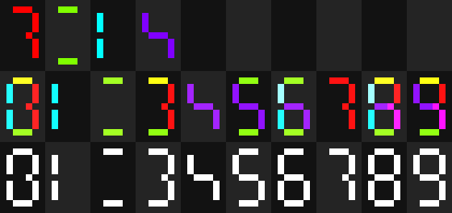
  
</p>

**4 segment display C**</br>
_Author: Mogi Mogi_

<p align="center">
  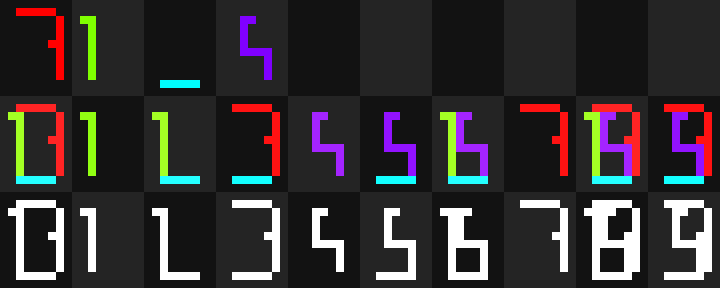
  
</p>

**4 segment display D**</br>
_Author: Mogi Mogi_

<p align="center">
  
  
</p>

**5 segment display A**</br>
_Author: Posy_

<p align="center">
  
  
</p>

**6 segment display A**

<p align="center">
  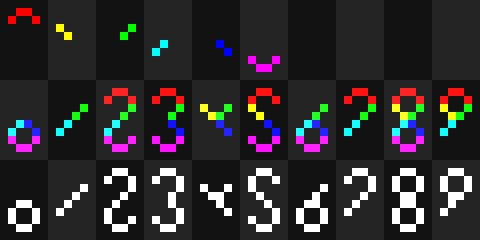
  
</p>

**6 segment display B**</br>
_Author: Yenji Jem_

<p align="center">
  
  
</p>

**6 segment display C**</br>
_Author: Serjão_

<p align="center">
  
  
</p>

**7 segment display A**

<p align="center">
  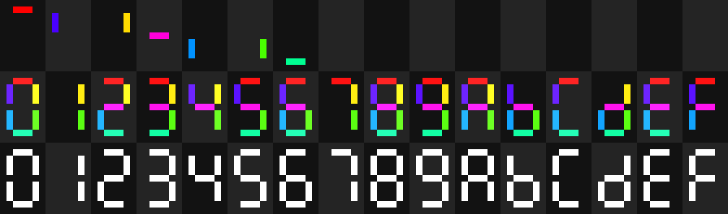
  
</p>

**8 segment display A**

<p align="center">
  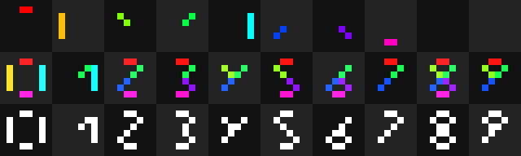
  
</p>

**8 segment display B**

<p align="center">
  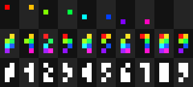
  
</p>

**8 segment display C (disconnected)**

<p align="center">
  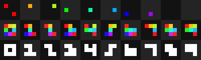
  
</p>

**9 segment display A**

<p align="center">
  
  
</p>

**10 segment display A (overlap)**</br>
If you have more segments than you have characters you may as well just assign each character it's own segment without any compromises.

<p align="center">
  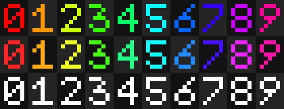
  
</p>

**11 segment display A**

<p align="center">
  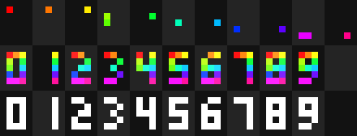
  
</p>

**12 segment display A**

<p align="center">
  
  
</p>

**13 segment display A (disconnected)**

<p align="center">
  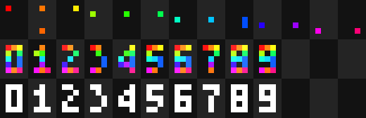
  
</p>

**15 segment display A**

<p align="center">
  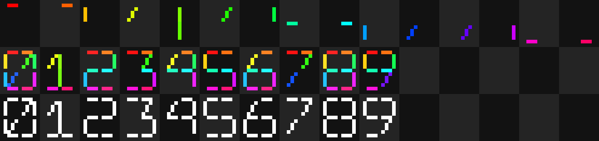
  
</p>

**18 segment display A**</br>
_Author: Posy_

<p align="center">
  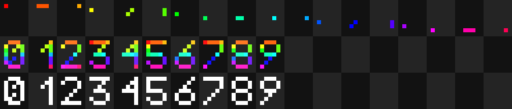
  
</p>

## Setup with [Node.js](https://nodejs.org/en/)

```bash
# Install Node.js (v20+ recommended)
sudo apt update
sudo apt install -y curl
curl -fsSL https://deb.nodesource.com/setup_18.x | sudo -E bash -
sudo apt install -y nodejs
# https://nodejs.org/en/download/ on Windows

# Install Yarn globally via npm
npm install --global yarn

# Clone the repository and navigate into it
git clone https://github.com/ebolblga/segmented-display-editor.git
cd segmented-display-editor

# Install all dependencies
yarn

# Start the project in development mode
yarn dev

# Format with Prettier
yarn format

# Lint with ESlint
yarn lint
```

## Contributors

<a href="https://github.com/ebolblga/segmented-display-editor/graphs/contributors">

</a>

## [License](https://github.com/ebolblga/segmented-display-editor/blob/master/LICENSE.md)

This program is licensed under the MIT License. Please read the License file to know about the usage terms and conditions.
