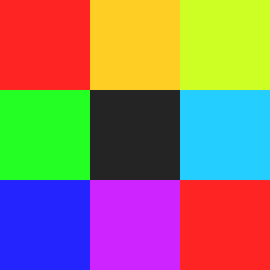

<div align="center">
  
  <h1>Редактор сегментного дисплея</h1>
</div>

## Веб-приложение, которое упрощает проектирование сегментных дисплеев

[](https://github.com/ebolblga/segmented-display-editor/blob/master/README.md)
[](https://github.com/ebolblga/segmented-display-editor/blob/master/README.ru.md)

[![DeepWiki](https://img.shields.io/badge/DeepWiki-ebolblga%2Fsegmented--display--editor-blue.svg?logo=data:image/png;base64,iVBORw0KGgoAAAANSUhEUgAAACwAAAAyCAYAAAAnWDnqAAAAAXNSR0IArs4c6QAAA05JREFUaEPtmUtyEzEQhtWTQyQLHNak2AB7ZnyXZMEjXMGeK/AIi+QuHrMnbChYY7MIh8g01fJoopFb0uhhEqqcbWTp06/uv1saEDv4O3n3dV60RfP947Mm9/SQc0ICFQgzfc4CYZoTPAswgSJCCUJUnAAoRHOAUOcATwbmVLWdGoH//PB8mnKqScAhsD0kYP3j/Yt5LPQe2KvcXmGvRHcDnpxfL2zOYJ1mFwrryWTz0advv1Ut4CJgf5uhDuDj5eUcAUoahrdY/56ebRWeraTjMt/00Sh3UDtjgHtQNHwcRGOC98BJEAEymycmYcWwOprTgcB6VZ5JK5TAJ+fXGLBm3FDAmn6oPPjR4rKCAoJCal2eAiQp2x0vxTPB3ALO2CRkwmDy5WohzBDwSEFKRwPbknEggCPB/imwrycgxX2NzoMCHhPkDwqYMr9tRcP5qNrMZHkVnOjRMWwLCcr8ohBVb1OMjxLwGCvjTikrsBOiA6fNyCrm8V1rP93iVPpwaE+gO0SsWmPiXB+jikdf6SizrT5qKasx5j8ABbHpFTx+vFXp9EnYQmLx02h1QTTrl6eDqxLnGjporxl3NL3agEvXdT0WmEost648sQOYAeJS9Q7bfUVoMGnjo4AZdUMQku50McDcMWcBPvr0SzbTAFDfvJqwLzgxwATnCgnp4wDl6Aa+Ax283gghmj+vj7feE2KBBRMW3FzOpLOADl0Isb5587h/U4gGvkt5v60Z1VLG8BhYjbzRwyQZemwAd6cCR5/XFWLYZRIMpX39AR0tjaGGiGzLVyhse5C9RKC6ai42ppWPKiBagOvaYk8lO7DajerabOZP46Lby5wKjw1HCRx7p9sVMOWGzb/vA1hwiWc6jm3MvQDTogQkiqIhJV0nBQBTU+3okKCFDy9WwferkHjtxib7t3xIUQtHxnIwtx4mpg26/HfwVNVDb4oI9RHmx5WGelRVlrtiw43zboCLaxv46AZeB3IlTkwouebTr1y2NjSpHz68WNFjHvupy3q8TFn3Hos2IAk4Ju5dCo8B3wP7VPr/FGaKiG+T+v+TQqIrOqMTL1VdWV1DdmcbO8KXBz6esmYWYKPwDL5b5FA1a0hwapHiom0r/cKaoqr+27/XcrS5UwSMbQAAAABJRU5ErkJggg==)](https://deepwiki.com/ebolblga/segmented-display-editor)

## Введение

Это вспомогательный инструмент, созданный для проекта, который будет опубликован немного позже. Его цель - проектирование 4-сегментного дисплея с использованием машинного обучения (ML). На раннем этапе разработки я столкнулся с проблемой проверки дизайна в действии и его модификации, поэтому этот инструмент был создан, чтобы упростить мне жизнь.

> [!NOTE]
> Вклад в этот репозиторий приветствуется - вы можете улучшать инструмент или добавлять новые пресеты сегментных дисплеев. Подробнее о том, как внести вклад, на странице [development guide](https://github.com/ebolblga/segmented-display-editor?tab=contributing-ov-file).

## Как пользоваться

<p align="center">
  
</p>

**Создание таблицы истинности**

На главной странице в выпадающем списке находятся пресеты. Это хорошая отправная точка — каждый пресет загружает JSON-файл с настройками приложения. Файл пресетов включает количество сегментов, размеры сегментов в пикселях и таблицу истинности: отображение символ → массив чисел. Символ может быть любой строкой Unicode, а массив чисел должен всегда иметь длину, равную количеству сегментов. `1` на `индексе n` означает, что сегмент n активирован для этого символа, а `0` — что он отключён.

```json
{
    "numSegments": 4,
    "segmentWidth": 7,
    "segmentHeight": 10,
    "truthTable": {
        "0": [1, 1, 1, 0],
        "1": [0, 1, 0, 0],
        "2": [0, 0, 1, 0],
        "3": [1, 0, 1, 0],
        "4": [0, 0, 0, 1],
        "5": [0, 0, 1, 1],
        "6": [0, 1, 1, 1],
        "7": [1, 0, 0, 0],
        "8": [1, 1, 1, 1],
        "9": [1, 0, 1, 1]
    },
    "baseUrl": "<this project's website>",
    "source": {
        "author": "<author name>",
        "url": "<source url>"
    }
}
```

> [!TIP]
> Вы можете редактировать JSON с настройками прямо на сайте, но для большего удобства я рекомендую использовать VSCode или Vim/Emacs - так удобнее править массивы чисел.

**Проектирование сегментов**

Когда вы определили количество сегментов, их размеры и таблицу истинности для символов, можно начать рисовать сами сегменты.

Вверху страницы показаны сегменты `0...n`. Вы можете рисовать на каждом сегменте левой кнопкой мыши (тапнуть на телефоне) и очищать пиксели правой кнопкой (задержать на телефоне). Изменения автоматически появятся на карте для всех символов, добавленных в таблицу истинности.

JSON с настройками проходит валидацию:

- проверяется, что все массивы чисел имеют длину, равную параметру numSegments;
- проверяется, что нет одинаковых строк - т.е. два символа не имеют одинаковой таблицы истинности.

Цвета назначаются автоматически путем равномерного прокручивания оттенка в цветовом пространстве HSV и являются исключительно визуальными.

**Проверка таблицы**

Это простая вспомогательная функция. Возможно, что в вашей таблице есть сегменты, которые активируются в одинаковых шаблонах: когда один включается, другой тоже включается, и то же самое при отключении. Такие сегменты можно безопасно объединить в один и уменьшить число сегментов.

**Экспорт**

Вы можете экспортировать настройки кнопкой «_Export settings_», это скачает JSON-файл со всеми данными, включая ваши сегменты, закодированные в виде base64-строк. Если вы захотите импортировать сохранённые настройки обратно, просто вставьте содержимое JSON-файла в текстовое поле настроек приложения.

Чтобы сохранить сегменты и карту как изображения — щёлкните правой кнопкой мыши по ним и выберите «_Save as..._».

**Генерация шрифта**

Если нажать кнопку «_Export Yal Settings_», будет скачано два файла: `yal-settings.json` и `character-map.png`. Их предполагается импортировать на сайт [Yal pixel font](https://yal.cc/tools/pixel-font/).

> [!WARNING]
> Я не связан с сайтом Yal — если API изменится или сайт перестанет работать, функция генерации шрифта может перестать работать.

После нажатия кнопки вы будете перенаправлены на сайт Yal. Нажмите кнопку «_Menu_», затем «_Import settings_» и выберите скачанный файл `yal-settings.json`. Дальше нажмите «_Pick image_» и выберите `character-map.png`. Затем можно отредактировать метаданные и сгенерировать шрифт в формате TTF или OTF.

**Бонус**

Favicon динамически обновляется, отображая все ваши сегменты, наложенные друг на друга в режиме аддитивного смешивания.

## Примеры

Вы увидите термины _disconnected_ и _overlap_ в скобках рядом с названиями сегментных дисплеев. _Disconnected_ означает, что хотя бы один сегмент имеет разъединённые части (по [расстоянию Чебышёва](https://ru.wikipedia.org/wiki/%D0%A0%D0%B0%D1%81%D1%81%D1%82%D0%BE%D1%8F%D0%BD%D0%B8%D0%B5_%D0%A7%D0%B5%D0%B1%D1%8B%D1%88%D1%91%D0%B2%D0%B0) между частями больше 1). _Overlap_ означает, что сегменты перекрываются и их может быть невозможно проложить/подключить в реальности без физического добавления отдельного сегмента в месте перекрытия.

**4 сегментный дисплей A (disconnected)**

<p align="center">
  
</p>

**4 сегментный дисплей B (disconnected, overlap)**

<p align="center">
  
</p>

**4 сегментный дисплей C**</br>
_Автор: Mogi Mogi_

<p align="center">
  
</p>

**4 сегментный дисплей D**</br>
_Автор: Mogi Mogi_

<p align="center">
  
</p>

**5 сегментный дисплей A**</br>
_Автор: Posy_

<p align="center">
  
</p>

**6 сегментный дисплей A**

<p align="center">
  
</p>

**6 сегментный дисплей B**</br>
_Автор: Yenji Jem_

<p align="center">
  
</p>

**6 сегментный дисплей C**</br>
_Автор: Serjão_

<p align="center">
  
</p>

**7 сегментный дисплей A**

<p align="center">
  
</p>

**8 сегментный дисплей A**

<p align="center">
  
</p>

**8 сегментный дисплей B**

<p align="center">
  
</p>

**8 сегментный дисплей C (disconnected)**

<p align="center">
  
</p>

**9 сегментный дисплей A**

<p align="center">
  
</p>

**10 сегментный дисплей A (overlap)**</br>
Если у вас больше сегментов, чем символов, вы можете просто назначить каждому символу свой собственный сегмент без каких-либо компромиссов.

<p align="center">
  
</p>

**11 сегментный дисплей A**

<p align="center">
  
</p>

**12 сегментный дисплей A**

<p align="center">
  
</p>

**13 сегментный дисплей A (disconnected)**

<p align="center">
  
</p>

**15 сегментный дисплей A**

<p align="center">
  
</p>

**18 сегментный дисплей A**</br>
_Автор: Posy_

<p align="center">
  
</p>

## Запуск с помощью [Node.js](https://nodejs.org/en/)

```bash
# Установка Node.js (рекомендуется v20+)
sudo apt update
sudo apt install -y curl
curl -fsSL https://deb.nodesource.com/setup_18.x | sudo -E bash -
sudo apt install -y nodejs
# https://nodejs.org/en/download/ на Windows

# Установка Yarn глобально через npm
npm install --global yarn

# Склонируйте репозиторий и зайдите в него
git clone https://github.com/ebolblga/segmented-display-editor.git
cd segmented-display-editor

# Установка зависимостей
yarn

# Запуск dev сервера
yarn dev

# Форматирование через Prettier
yarn format

# Линтинг через ESlint
yarn lint
```

## Контрибьюторы

<a href="https://github.com/ebolblga/segmented-display-editor/graphs/contributors">

</a>

## [Лицензия](https://github.com/ebolblga/segmented-display-editor/blob/master/LICENSE.md)

Эта программа распространяется под лицензией MIT License. Пожалуйста, прочтите файл лицензии, чтобы узнать об условиях использования.
